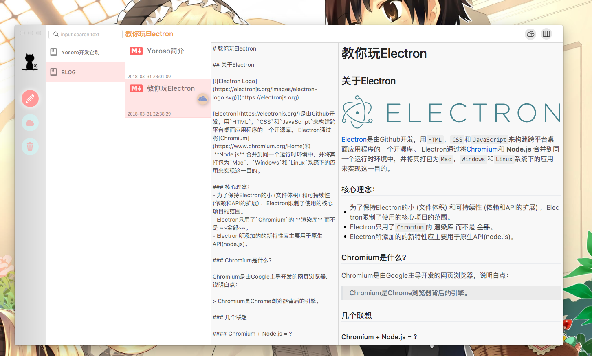
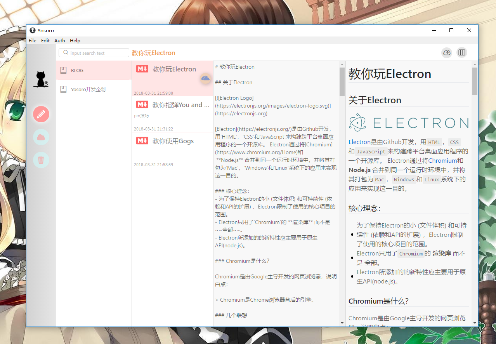
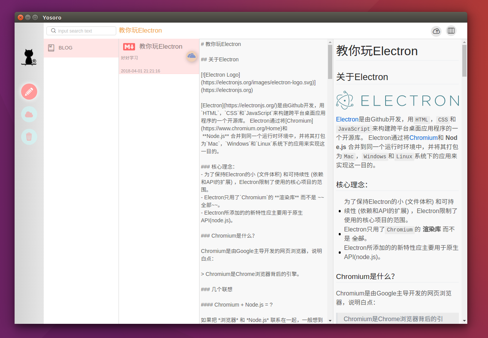

  
  <h3 align="center">Yosoro</h3>
  
Moe Cloud Driver Markdown NoteBook Desktop App

  

    
  

  

    
    
    
  

## Download

The latest version of Yosoro for macOS, linux and Windows is avalibale [here](https://github.com/IceEnd/Yosoro/releases).

**macOS 10.9+, Windows 7+ & Linux are supported.**

## Features

- Create notebook & Write note
- Support Markdown syntax
- Delete & Restore
- Synchronize with Cloud Driver(oneDriver is supported)

## Screenshots

### macOS

### Windows

### linux

## License

BSD-4 © [Alchemy](./LICENSE)
